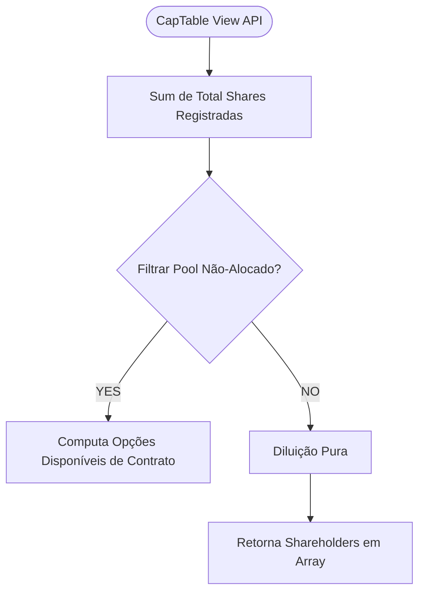

# SDD 003: Cap Table Manager e Tracking de Equity

## 1. Resumo Executivo
Permitir que usuários visualizem com granularidade e gravem transações da sua matriz de ações societárias. Baseando-se nas regras de que Participações de Cap Table funcionam puramente via "Append-only Log" sob proteção legal para impedir a re-escrita direta das ações primárias, sendo imutáveis sob Auditoria.

## 2. Architecture Context
- **Supabase DB:** Duas tabelas estritas — As rodadas de Investimento (Snapshots) e os Grants de Colaboradores (ESOPs individualizados sob Cliff Time limit).
- O backend calculará "Diluições em Tempo Real" usando o SQL como a fonte de cálculos matemáticos.

## 3. Diagrama Matemático em SQL / API

## 4. Componentes e Tabelas Estrituradas Modeladas
| Schema/Estrutura                       | Tipo         | Ação Funcional (Módulo Inv Rls)                   |
| -------------------------------------- | ------------ | ------------------------------------------------- |
| `equity_grants`                        | Supabase Tbl | Histórico intocável (Grant Date, Amount, Cliff).  |
| `apps/api/src/routes/investor/equity`  | API          | Calculadora Validadora se Emissão Ultrapassou 100%|
| `apps/web/src/modules/investor/views/captable.tsx`| UI | Tabela Radix para exibição matemática tabular. |

## 5. Segurança do Banco e Front
- Se houver deleção de um grant societário (Opção Expirada), será tratada via Soft Delete (`canceled_at`), preservando dados jurídicos.
- O Frontend não pode, nunca, utilizar pontos flutuantes cruéis que geram perdas dizimais (Ex. Floats Puros em Javascript gerando .00000001 nas quotas). Requisita-se manipulação via bibliotecas `Big.js` ou decimal casting puro.
